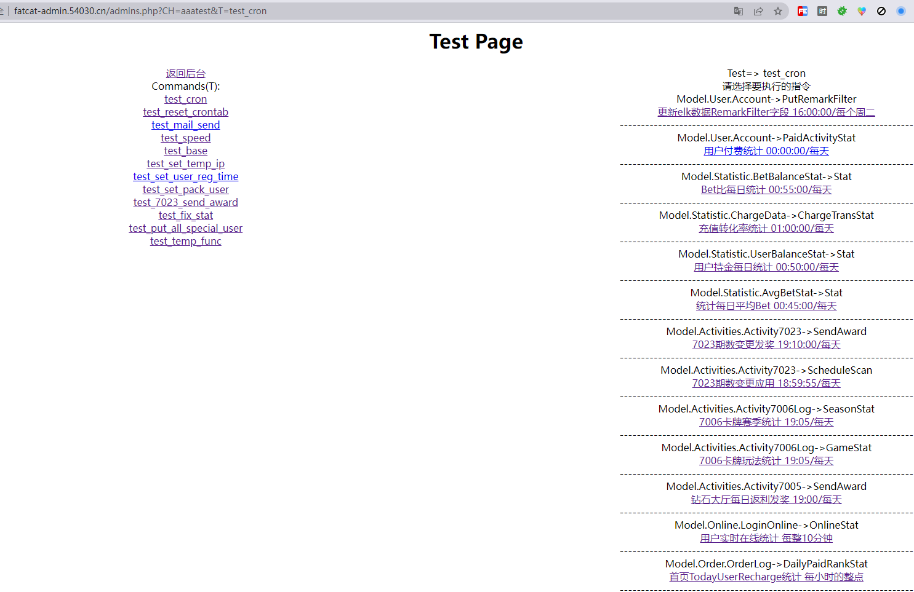

# 命令行工具

## 核心代码

1. 代码文件: artisan

```php
#!/usr/bin/env php
<?php
// 根目录执行 php artisan进入工具

exec('chcp 65001'); //中文乱码

//加载基础框架
define('CH_Root', 'Admins');
define("WEBPATH", str_replace("\\", "/", dirname(__FILE__)));
require 'ConfigInc.php';
require 'global.inc.php';
require 'CHCore/CHCore.php';
require 'functions.php';
global $ConfigDB, $Database;
define("DBName", $ConfigDB[$Database]['Master']['dbname']);

//定义环境
define("ENV", "cil");


//初始化所有命令
$Command = [
    "test" => [ //工具主题
        "handler" => "Controllers/www/aaatest.php", //文件路径
        "class" => false, //是否是类 如果是则是类名
        "tools" => [ //工具命令集合
            [
                "key" => "temp_func", //工具命令
                "desc" => "执行aaatest文件中的test_temp_func函数" //工具描述
            ]
        ]
    ]
];

//获取输入参数
$argv = $argv ?: [];
array_shift($argv);
if (sizeof($argv) === 0)
{
    help($Command);
    return;
}

//第二个之后的为额外参数 会被加载进GET
$More = array_slice($argv, 2);
if (sizeof($More) > 0)
{
    foreach ($More as $item)
    {
        if (strpos($item, '-') === false)
            continue;

        $item = substr($item, 1);
        list($key, $val) = explode("=", $item);
        if (is_null($key) || is_null($val))
            continue;

        $_GET[$key] = iconv("gbk","utf-8", $val) ?: $val;
    }
}

//解析参数 合格参数进行执行
if (isset($Command[$argv[0]]))
{
    $Target = $Command[$argv[0]];
    if (sizeof($argv) === 1)
    {
        help($Command, $argv[0]);
        return;
    } else
    {
        $CommandKey = $argv[1];
        $TargetCommand = array_filter($Target['tools'], function ($Row) use ($CommandKey)
        {
            return $Row['key'] == $CommandKey;
        });

        if (sizeof($TargetCommand) === 0)
        {
            out('Command "' . $argv[0] . " " . $argv[1] . '" is not defined. For Help: php artisan h', 'error');
            return;
        }
        $TargetCommand = current($TargetCommand);

        require_once $Target['handler'];
        if (!$Target['class'])
        {
            $TargetCommand['key']();
            return;
        }

        $Model = new $Target['class']();
        $Model->Handler($TargetCommand['key']);
        return;
    }
} else
{
    if ($argv[0] === 'h' || $argv[0] === 'help')
    {
        help($Command);
        return;
    } else
    {
        out('Command "' . $argv[0] . '" is not defined. For Help: php artisan h', 'error');
        return;
    }
}

function help($Command, $SpecialNameSpace = false)
{
    out("Available commands:", "info");
    foreach ($Command as $NameSpace => $Commands)
    {
        if ($SpecialNameSpace && $SpecialNameSpace != $NameSpace)
            continue;
        out($NameSpace, "success");
        foreach ($Commands['tools'] as $Com)
        {
            out(str_pad("{$NameSpace} {$Com['key']}", 40) . $Com['desc']);
        }
    }
}

function out($text, $color = null, $newLine = true)
{
    $styles = array(
        'success' => "\033[0;32m%s\033[0m",
        'error' => "\033[31;31m%s\033[0m",
        'info' => "\033[33;33m%s\033[0m"
    );

    $format = '%s';

    if (isset($styles[$color]))
        $format = $styles[$color];

    if ($newLine)
        $format .= PHP_EOL;

    printf($format, $text);
}
```

2. 放置到项目根目录


3. 执行


## 有什么用?

1. 快速测试代码
2. 接入更多 (生成常用代码示例)

- 添加一个`make`的命令主题
``` php
//初始化所有命令
$Command = [
    "test" => [ //工具主题
        "handler" => "Controllers/www/aaatest.php", //文件路径
        "class" => false, //是否是类 如果是则是类名
        "tools" => [ //工具命令集合
            [
                "key" => "temp_func", //工具命令
                "desc" => "执行aaatest文件中的test_temp_func函数" //工具描述
            ]
        ]
    ],
    "make" => [
        "handler" => "Model/Console/ArtisanMake.php",
        "class" => "ArtisanMake",
        "tools" => [
            [
                "key" => "activity",
                "desc" => "创建一个活动的Controller+Model 可选参数: -ActiID(A/a)=活动ID -Title(Ti/ti)=标题 -Author(Au/au)=作者"
            ]
        ]
    ],
];
```

- 创建一个接口 `IArtisan.php`

```php
<?php

interface IArtisan
{
    public function Handler($Key);
}
```

- artisan文件修改 添加方法

``` php
  /**
   * @param $Module
   * @return IArtisan
   */
  function GetModule($Class)
  {
      $Class = new $Class();
      if ($Class instanceof IArtisan)
          return $Class;
      else
          throw new Exception("需要实现IArtisan接口");
  }
```
- artisan文件修改
``` php
//$Model = new $Target['class']();
$Model = GetModule($Target['class']);
```


- 创建代码实现类 实现IArtisan接口


3. 快速测试定时任务执行
    同样方式接入定时任务执行 输入命令 执行对应定时任务方法

4. 测试队列任务执行

5. 接入更多...

## 扩展到网页

### 核心代码

简单的样式
```php
header('Content-Type:text/html;charset=utf-8');
echo "<div style='text-align: center'><h1>Test Page</h1><div style='display: flex;justify-content: space-evenly;margin-bottom: 200px'>";
```

示例 添加定时任务到网页工具
获取所有定时任务配置

单个定时任务的结构
```php
[
    'PreCreateTables' => [
        'Remark' => '预创建月份表',
        'Module' => 'Model.Cron.ManageTables',
        'Func' => 'CreateTables',
        'DevTool' => ["&M=1" => "生成当月"],
        'CycleDesc' => "28号17.30/每月",
        'Crontab' => "30 17 28 * *"
]
```

解析定时任务配置到页面 或执行
```php
function test_cron()
{
    $BR = "<br>";

    require_once "Controllers/www/cron.php";
    $CronHandler = new CronHandler();

    echo "请选择要执行的指令" . $BR;
    $CronConfigs = $CronHandler->LoadFuncTable();
    $CronConfigs = array_reverse($CronConfigs);
    foreach ($CronConfigs as $Func => $Item)
    {
        $Url = "?CH=aaatest&T=test_cron&C=$Func";
        if ($_GET['tk'])
            $Url .= "&tk={$_GET['tk']}";
        echo "{$Item['Module']}->{$Item['Func']}" . $BR . "<a href='{$Url}'>{$Item['Remark']} {$Item['CycleDesc']}</a>" . $BR;

        if (isset($Item['DevTool']) && sizeof($Item['DevTool']))
        {
            foreach ($Item['DevTool'] as $Params => $Desc)
            {
                echo "{$Item['Module']}->{$Item['Func']} [{$Params}]" . $BR . "<a href='{$Url}{$Params}'>{$Item['Remark']} {$Desc}</a>" . $BR;
            }
        }

        echo "---------------------------------------------------------------------" . $BR;
    }
    echo "</div>";

    $C = ToString($_GET['C']);
    if ($C != "")
    {
        $t1 = microtime(true);

        echo "<div style='flex: 1'>执行中..." . $BR;

        $CronHandler->Handler($C);

        $t2 = microtime(true);
        echo '消耗内存: ' . memory_get_usage() . '<br />';
        echo '耗时: ' . round($t2 - $t1, 6) . '秒<br>';
        echo '结束时间: ' . date("Y-m-d H:i:s", $t2) . '<br />';
        echo "</div>";
    }
}
```

最后加上小尾巴
```php
echo "</div></div>";
```

### 页面展示

- 测试工具主页面


- 点击test_cron进入定时任务列表页


- 通过网页点击执行一个定时任务

